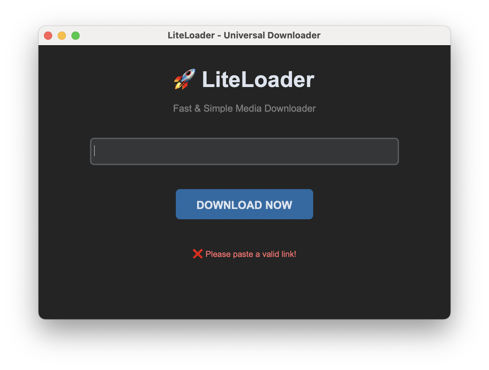

# 🚀 LiteLoader

**LiteLoader** is a high-performance, minimalist video downloader built with Python. Download high-quality content from YouTube, Instagram, and 100+ other platforms with zero hassle.



### ✨ Key Features
* **🎨 Modern UI:** A sleek, dark-mode interface built with `CustomTkinter`.
* **💎 High Quality:** Automatically merges the best video and audio streams.
* **💻 Cross-Platform:** Runs seamlessly on Windows, macOS, and Linux.
* **⚡ Lightweight:** Optimized for speed and minimal resource consumption.

---

### 🛠️ Prerequisites
To handle high-quality (1080p+) processing, **FFmpeg** is required:

* **macOS:** `brew install ffmpeg`
* **Windows/Linux:** Download from [ffmpeg.org](https://ffmpeg.org/download.html)

---

### 🚀 Installation

1. **Clone the repository:**
   ```bash
   git clone [https://github.com/areldemircan/LiteLoader.git](https://github.com/areldemircan/LiteLoader.git)
   cd LiteLoader
Install dependencies:

Bash
pip install -r requirements.txt
Launch the app:

Bash
python3 main.py
👨‍💻 Author

Created by Arel Demircan Feel free to star ⭐ the repo if you find it useful!
